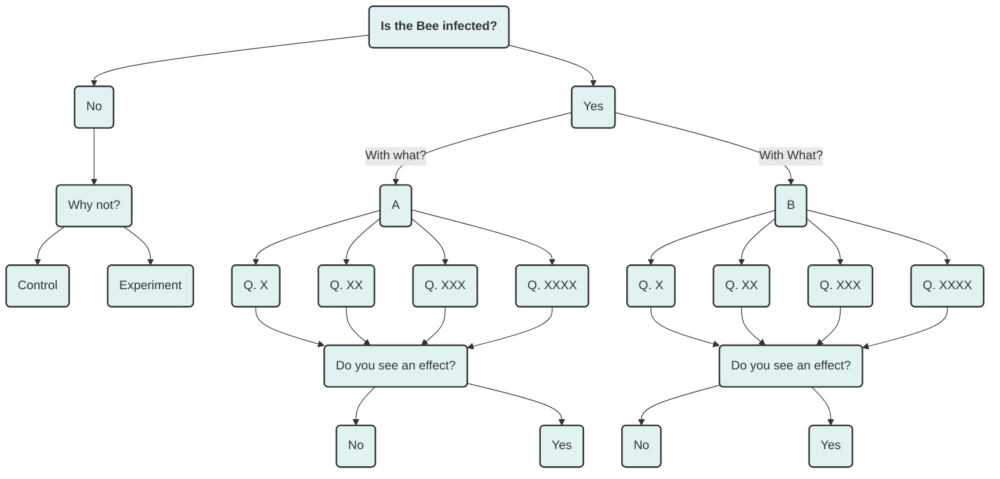

```mermaid
graph TD
A(<b>Is the Bee infected?) --> B(No)
A --> C(Yes)
B -->D(Why not?)
D --> F(Control)
D --> G(Experiment)
C -- With what? --> H(A)
C -- With What? --> I(B)
H --> J(Q. X)
H --> K(Q. XX)
H --> L(Q. XXX)
H --> M(Q. XXXX)
I --> N( Q. X)
I --> O(Q. XX)
I --> P(Q. XXX)
I --> Q(Q. XXXX)
N --> U(Do you see an effect)
O --> U(Do you see an effect?)
P --> U
Q --> U
J --> R(Do you see an effect?)
K --> R
L --> R
M --> R
R --> S(No)
R --> T(Yes)
U --> V(No)
U --> W(Yes)


style A fill:#e0f2f2,stroke:#333333,stroke-width:2px;
style B fill:#e0f2f2,stroke:#333333,stroke-width:2px;
style C fill:#e0f2f2,stroke:#333333,stroke-width:2px;
style D fill:#e0f2f2,stroke:#333333,stroke-width:2px;
style F fill:#e0f2f2,stroke:#333333,stroke-width:2px;
style G fill:#e0f2f2,stroke:#333333,stroke-width:2px;
style H fill:#e0f2f2,stroke:#333333,stroke-width:2px;
style I fill:#e0f2f2,stroke:#333333,stroke-width:2px;
style J fill:#e0f2f2,stroke:#333333,stroke-width:2px;
style K fill:#e0f2f2,stroke:#333333,stroke-width:2px;
style L fill:#e0f2f2,stroke:#333333,stroke-width:2px;
style M fill:#e0f2f2,stroke:#333333,stroke-width:2px;
style N fill:#e0f2f2,stroke:#333333,stroke-width:2px;
style O fill:#e0f2f2,stroke:#333333,stroke-width:2px;
style P fill:#e0f2f2,stroke:#333333,stroke-width:2px;
style Q fill:#e0f2f2,stroke:#333333,stroke-width:2px;
style R fill:#e0f2f2,stroke:#333333,stroke-width:2px;
style S fill:#e0f2f2,stroke:#333333,stroke-width:2px;
style T fill:#e0f2f2,stroke:#333333,stroke-width:2px;
style U fill:#e0f2f2,stroke:#333333,stroke-width:2px;
style V fill:#e0f2f2,stroke:#333333,stroke-width:2px;
style W fill:#e0f2f2,stroke:#333333,stroke-width:2px;


```

